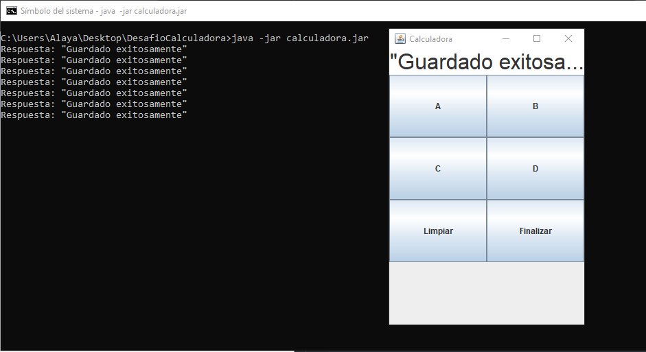
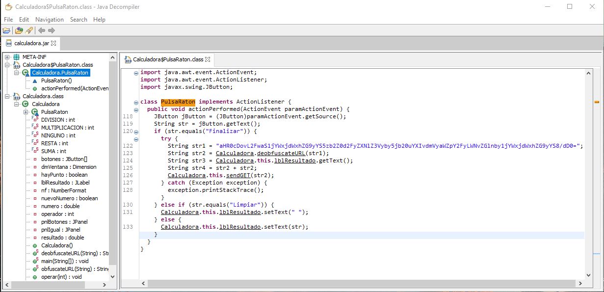
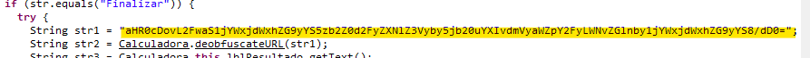
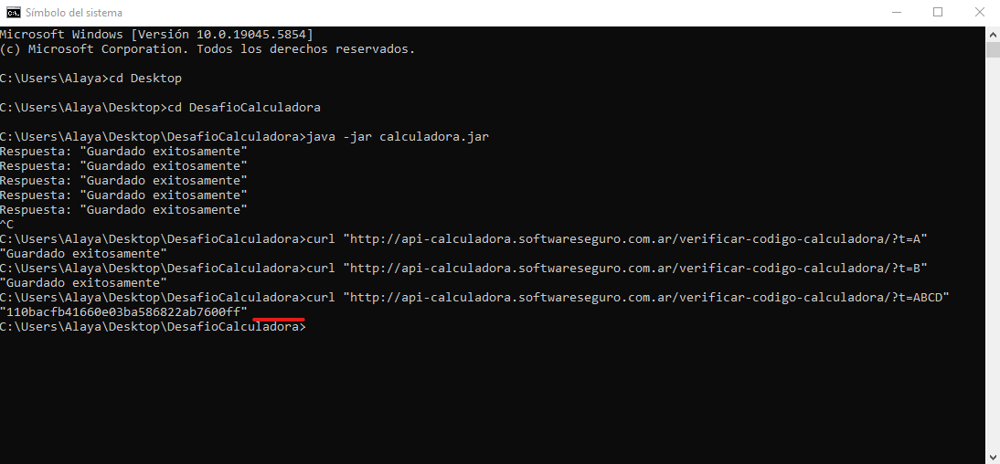
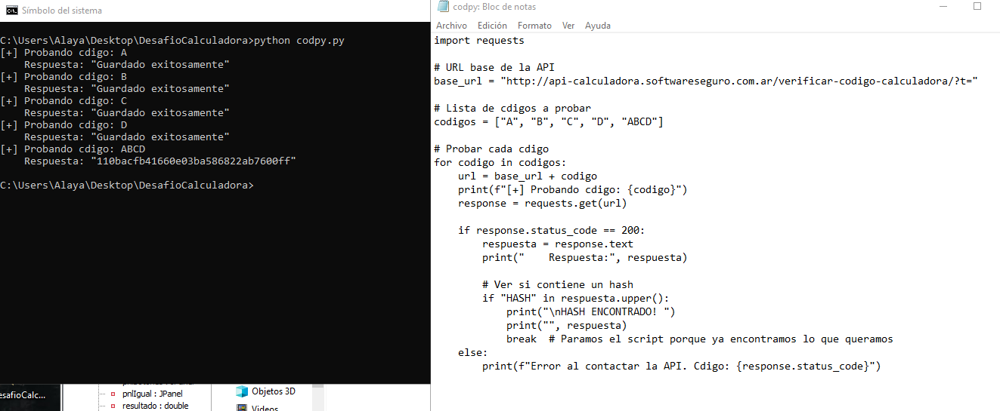

Este repositorio documenta el proceso de análisis y explotación de una aplicación Java (`calculadora.jar`) mediante ingeniería inversa.  
El desafío fue extraído del sitio [softwareseguro.com.ar](https://softwareseguro.com.ar), y se resolvió en un entorno Windows 11 con Git Bash, utilizando herramientas como JD-GUI, Python y curl.


# 🔍 Reversing de una Aplicación Java con API Oculta

Este repositorio documenta el proceso de análisis y explotación de una aplicación Java (`calculadora.jar`) mediante ingeniería inversa.
El objetivo fue encontrar un código oculto, interactuar con una API restringida y obtener un hash secreto como parte de un desafío de seguridad.

---

## 🧰 Herramientas utilizadas

- `curl` (para pruebas manuales contra la API)
- `Python` (automatización de pruebas de código)
- `JD-GUI` (para descompilar el archivo `.jar`)
- `Git Bash` (para versionado y subida del proyecto)
- `base64` (decodificación de URL oculta)

---

## 🧩 Descripción del desafío

> Sos un operario que por cada trabajo realizado en la fábrica necesitás subir un código desde una aplicación.  
>  
> El código A significa "Trabajo realizado".  
> El código B significa "En progreso".  
> El código C significa "Pendiente de revisión".  
> El código D significa "Cancelado o no aprobado".  
>
> Códigos como "ABCD" están prohibidos, pero vos descubriste que:
>
> 💰 `ABCD` = "Todo perfecto, ¡merece un aumento de sueldo!"
>
> Encontrá el hash que lo comprueba.

---
## 🚀 Ejecución inicial de la aplicación .jar
Antes de descubrir la API, se ejecutó el archivo calculadora.jar desde la terminal para observar su comportamiento como usuario final.


## 🧪 Análisis del archivo `.jar`

Se descompiló el archivo `calculadora.jar` con **JD-GUI** para entender la lógica interna de la app y 
detectar cómo interactuaba con una API oculta.

📷 

```bash
java -jar calculadora.jar
```
---

## 🔐 Descubrimiento de la API
Se usó JD-GUI para ver el contenido del código Java, donde durante el análisis se encontró una URL 
codificada en Base64 dentro del código:
📷 

📷 

Se decodificó la URL por medio de esta línea en el código, y se identificó la URL :
```python
import base64

url_ofuscada = "aHR0cDovL2FwaS1jYWxjdWxhZG9yYS5zb2Z0d2FyZXNlZ3Vyby5jb20uYXIvdmVyaWZpY2FyLWNvZGlnby1jYWxjdWxhZG9yYS8/dD0="
url = base64.b64decode(url_ofuscada).decode()
print(url)
``` 

 URL revelada:
http://api-calculadora.softwareseguro.com.ar/verificar-codigo-calculadora/?t=


### 🧪 Pruebas manuales con curl y Automatización con script en Python
Se desarrolló un script para probar múltiples códigos automáticamente:
Se probaron códigos válidos e inválidos manualmente:

curl "http://api-calculadora.softwareseguro.com.ar/verificar-codigo-calculadora/?t=A"

curl "http://api-calculadora.softwareseguro.com.ar/verificar-codigo-calculadora/?t=B"

📷 

```python
import requests

base_url = "http://api-calculadora.softwareseguro.com.ar/verificar-codigo-calculadora/?t="
codigos = ["A", "B", "C", "D", "ABCD"]

for codigo in codigos:
    url = base_url + codigo
    print(f"[+] Probando código: {codigo}")
    response = requests.get(url)

    if response.status_code == 200:
        respuesta = response.text
        print("    Respuesta:", respuesta)
        if "HASH" in respuesta.upper():
            print("\nHASH ENCONTRADO!")
            print(respuesta)
            break
    else:
        print(f"Error al contactar la API: {response.status_code}")

``` 

## ✅ Resultado final

Se descubrió que el código `ABCD` efectivamente devuelve un hash secreto que confirma que se cumplió el desafío.

## 📷 
---

## 📌 Conclusión

Este ejercicio demostró cómo técnicas básicas de reversing y análisis estático pueden revelar 
funcionalidades ocultas en una aplicación.  

🔐 **Seguridad por oscuridad no es seguridad real.**  
Codificar una URL en Base64 o bloquear códigos desde el cliente no protege frente a usuarios con 
conocimientos mínimos de análisis.

🧠 **Un buen pentester no solo encuentra la vulnerabilidad, también la comunica claramente.**

---

## 🛡️ Recomendaciones

- **Evitar lógica crítica en el cliente.**
- **Agregar autenticación y validaciones del lado del servidor.**
- **No confiar en mecanismos de ofuscación débiles como Base64.**
- **Registrar y limitar intentos anómalos o combinaciones sospechosas.**

---

## 🎯 Impacto estratégico

Esta vulnerabilidad podría permitir automatizar la aceptación de trabajos no autorizados, falsificar 
estados de producción y generar recompensas indebidas.  
En un entorno real, esto podría representar **fraude interno** o **abuso de lógica empresarial**.

---

## 📎 Recursos del proyecto

- Código Python para automatización (`check_api.py`)
- Capturas del análisis (`/img`)
- Script de decodificación (`decode_url.py`)
- Archivo `calculadora.jar` (no subido por motivos legales, se trabajó localmente)


---

## 🖥️ Entorno de trabajo

- **Sistema Operativo:** Windows 10
- **Terminal utilizada:** Git Bash / cmd
- **Editor/IDE:** Visual Studio Code / Bloc de notas
- **Repositorio remoto:** GitHub
- **Navegador:** Chrome 
